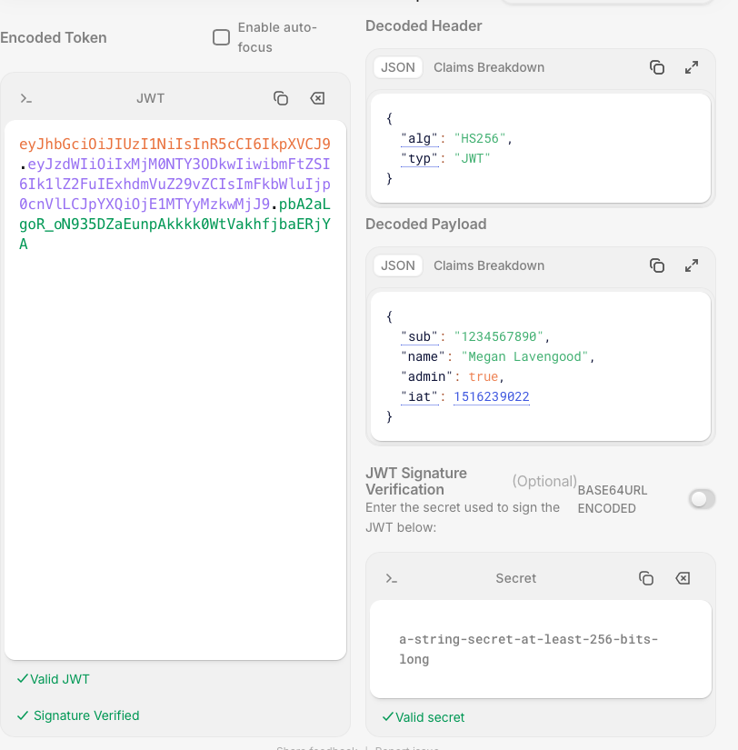
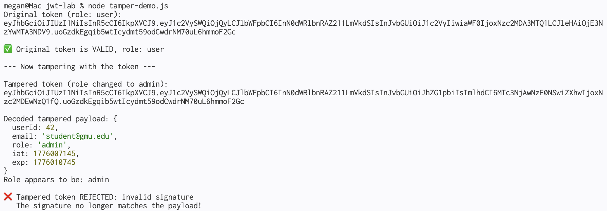
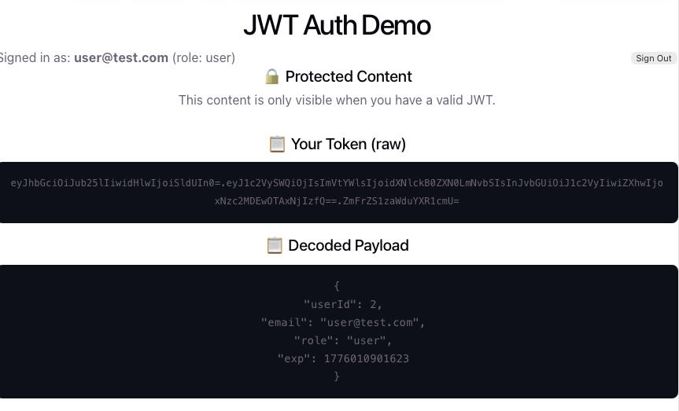

# GitHub Repo

https://github.com/meganlavengood/jwt-lab

---

# Screenshots

---

# JWT Security Questions

Answer each question in 2-3 sentences. Refer to what you observed in your scripts when possible.

## Question 1

**Why shouldn't you store passwords or credit card numbers in a JWT payload?**

Your answer: It's not encrypted. Anyone can decode base 64.

## Question 2

**What happens if someone steals your JWT secret key? What's the impact, and what would you need to do?**

Your answer: That person could tamper with the token. By tampering with it, they could do things like change the permissions of the user, etc. I guess the secret key would need to be reset, or the account would need to be deactivated altogether.

## Question 3

**Why do JWTs have an expiration time (`exp` claim)? What would happen if tokens never expired?**

Your answer: It adds another layer of security. If the information is stolen, it will only work for that predefined amount of time. If the token never expired, an attacker could use it at any time. We saw this in **expire-demo**, where the token expired after only a few seconds.

## Question 4

**In the tamper demo, you changed `role` from `"user"` to `"admin"` and `jwt.decode()` showed it as admin. But `jwt.verify()` rejected it. Explain why this matters — what would go wrong if a server used `decode()` instead of `verify()`?**

Your answer: `verify()` ensures that the data hasn't been tampered with by checking the signature of the JWT. It essentially makes sure the update is valid before executing that update. The **verify-token** demo showed how, if the server used `decode()`, the signature would never be checked in this way and everything would go through.

## Question 5

**Supabase Auth stores the JWT in the browser's `localStorage`. Research one risk of storing tokens in localStorage (hint: think about XSS). What's an alternative storage method that's more secure?**

Your answer: `localStorage` can be accessed wtih Javascript, so a simple script can pull the information from the cookies stored there. `HttpOnly` secure cookies are not allowed to be accessed with JS. A student mentioned this in their reply to my discussion post.
